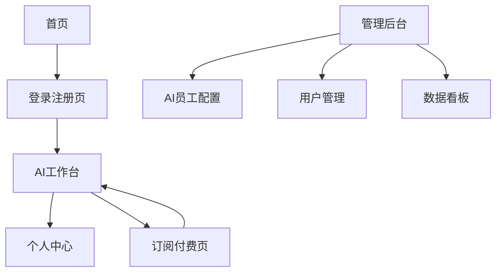

# Dify智能应用管理平台 - 产品需求文档

## 1. 产品概述

为短视频创作者提供一支全天候在线的AI员工团队，通过覆盖内容创作全流程的专业AI助手，帮助创作者提升效率、激发创意、实现商业成功。

- 主要面向中国的短视频创作者，包括个人内容创作者、MCN机构、企业/品牌自媒体团队
- 解决内容创作流程繁琐、团队协作成本高、创意和效率难以兼得等痛点
- 通过SaaS平台提供多个专业AI智能体组成的"AI员工团队"服务

## 2. 核心功能

### 2.1 用户角色

| 角色 | 注册方式 | 核心权限 |
|------|----------|----------|
| 免费用户 | 邮箱注册 | 可使用部分AI员工，有月度使用次数限制 |
| 专业版用户 | 付费升级 | 解锁全部AI员工团队，更高使用次数上限 |
| 团队版用户 | 付费升级 | 更高资源配额，支持多账号协作功能 |
| 平台管理员 | 内部分配 | 管理AI员工配置、用户管理、数据统计 |

### 2.2 功能模块

我们的平台包含以下主要页面：
1. **首页**：产品介绍、功能展示、用户引导
2. **登录注册页**：邮箱注册、微信/支付宝扫码登录
3. **AI工作台**：左侧AI员工选择栏、右侧交互对话区
4. **个人中心**：账户信息、订阅状态、安全设置
5. **订阅付费页**：套餐选择、支付流程、订单管理
6. **管理后台**：AI员工配置、用户管理、数据看板

### 2.3 页面详情

| 页面名称 | 模块名称 | 功能描述 |
|----------|----------|----------|
| 首页 | 产品介绍区 | 展示AI员工团队概念，产品价值说明，用户案例展示 |
| 首页 | 功能导航 | 快速访问主要功能，用户引导流程 |
| 登录注册页 | 用户注册 | 邮箱注册，集成腾讯企业邮箱服务 |
| 登录注册页 | 用户登录 | 微信/支付宝扫码登录，邮箱密码登录 |
| AI工作台 | AI员工选择栏 | 垂直列表展示所有AI员工，职位名称和头像显示，选中状态高亮 |
| AI工作台 | 交互对话区 | 聊天式界面，多轮对话，历史记录查看，一键复制内容 |
| AI工作台 | AI员工管理 | 人设定位师、选题策划师、金牌文案、拍摄总监、剪辑助理、发布优化师 |
| 个人中心 | 账户管理 | 个人信息编辑，密码修改，安全设置 |
| 个人中心 | 订阅状态 | 当前套餐显示，使用次数统计，续费提醒 |
| 订阅付费页 | 套餐选择 | 免费版、专业版、团队版对比展示 |
| 订阅付费页 | 支付流程 | 微信支付、支付宝集成，订单确认 |
| 订阅付费页 | 订单管理 | 订单历史查询，电子发票申请 |
| 管理后台 | AI员工配置 | 员工信息管理，API配置，套餐权限设置 |
| 管理后台 | 用户管理 | 用户列表查看，订阅状态管理 |
| 管理后台 | 数据看板 | 核心运营数据统计，使用情况分析 |

## 3. 核心流程

**新用户注册使用流程：**
用户访问首页了解产品 → 邮箱注册账户 → 扫码登录系统 → 观看功能引导了解AI员工团队概念 → 在左侧边栏选择AI员工开始试用对话 → 触发付费限制时选择套餐升级 → 完成扫码支付 → 解锁全部AI员工功能

**管理员配置流程：**
管理员登录后台 → 配置AI员工信息和API接口 → 设置套餐权限和使用限制 → 监控用户使用数据和系统运行状态

## 4. 用户界面设计

### 4.1 设计风格

- **主色调**：科技蓝#1890FF，辅助色橙色#FF7A00
- **按钮样式**：圆角按钮，渐变效果，悬停状态变化
- **字体**：中文使用苹方/微软雅黑，英文使用Roboto，主要字号14px-16px
- **布局风格**：卡片式设计，左侧导航布局，响应式网格系统
- **图标风格**：线性图标风格，AI员工使用拟人化头像设计

### 4.2 页面设计概览

| 页面名称 | 模块名称 | UI元素 |
|----------|----------|--------|
| 首页 | 产品介绍区 | 大标题渐变文字，产品演示视频，特色功能卡片展示 |
| AI工作台 | AI员工选择栏 | 垂直卡片列表，员工头像圆形设计，选中状态蓝色高亮边框 |
| AI工作台 | 交互对话区 | 聊天气泡样式，用户消息右对齐蓝色，AI回复左对齐灰色背景 |
| 订阅付费页 | 套餐选择 | 三栏对比卡片，推荐套餐金色边框，价格数字大号显示 |
| 管理后台 | 数据看板 | 统计卡片网格布局，图表使用ECharts组件，数据实时更新 |

### 4.3 响应式设计

采用桌面优先的响应式设计，支持移动端适配。AI工作台在移动端采用抽屉式侧边栏，支持触摸手势操作和语音输入功能。