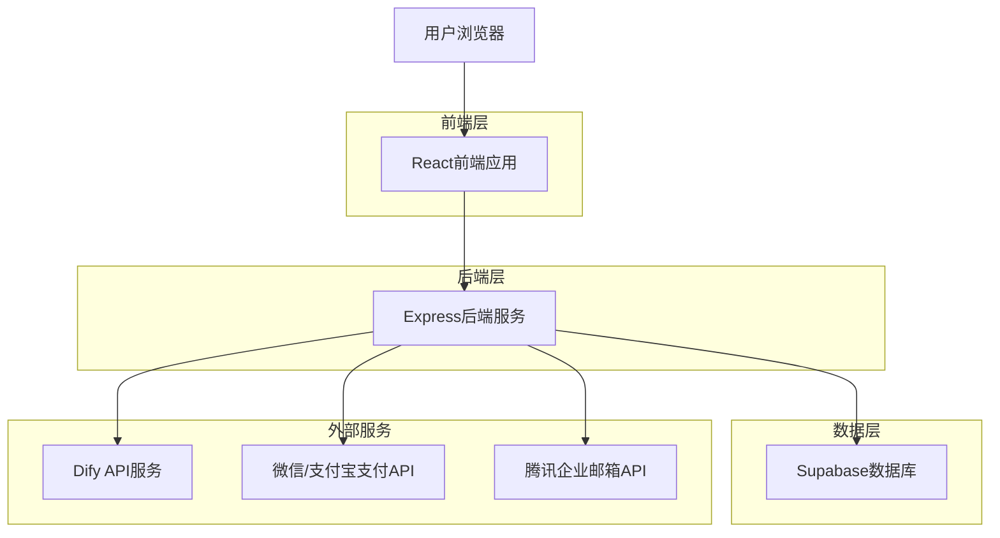
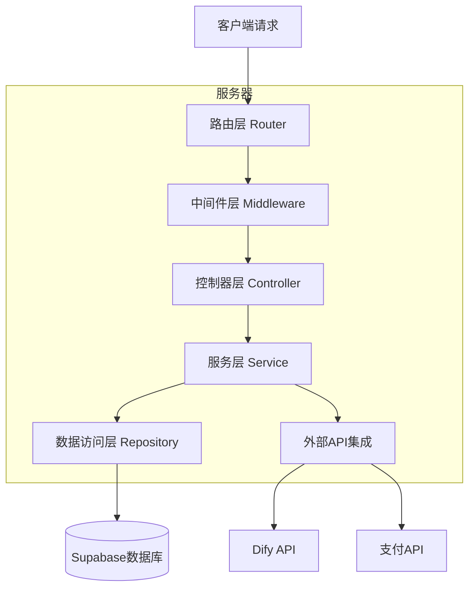
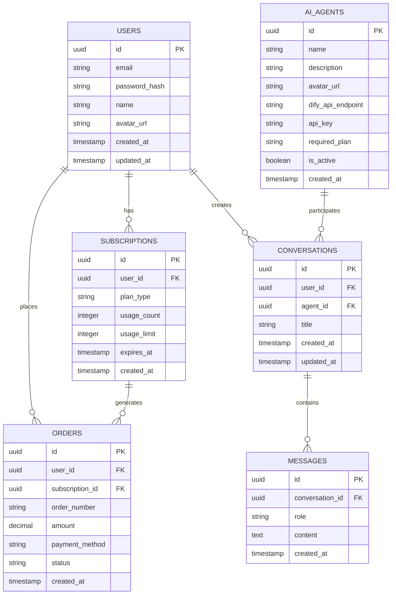

# Dify智能应用管理平台 - 技术架构文档

## 1. 架构设计



## 2. 技术描述

* **前端**: React\@18 + TypeScript + Tailwind CSS + Vite + Ant Design

* **后端**: Express\@4 + TypeScript + JWT认证

* **数据库**: Supabase (PostgreSQL)

* **外部集成**: Dify API、微信支付、支付宝、腾讯企业邮箱

## 3. 路由定义

| 路由               | 用途             |
| ---------------- | -------------- |
| /                | 首页，产品介绍和功能展示   |
| /login           | 登录页面，支持邮箱和扫码登录 |
| /register        | 注册页面，邮箱注册流程    |
| /workspace       | AI工作台，核心功能页面   |
| /profile         | 个人中心，账户管理和订阅状态 |
| /pricing         | 订阅付费页面，套餐选择和支付 |
| /admin           | 管理后台，平台管理功能    |
| /admin/ai-agents | AI员工配置管理       |
| /admin/users     | 用户管理           |
| /admin/dashboard | 数据看板           |

## 4. API定义

### 4.1 用户认证相关

**用户注册**

```
POST /api/auth/register
```

请求参数:

| 参数名      | 参数类型   | 是否必需 | 描述   |
| -------- | ------ | ---- | ---- |
| email    | string | true | 用户邮箱 |
| password | string | true | 用户密码 |
| name     | string | true | 用户姓名 |

响应:

| 参数名     | 参数类型    | 描述      |
| ------- | ------- | ------- |
| success | boolean | 注册是否成功  |
| token   | string  | JWT认证令牌 |
| user    | object  | 用户信息    |

**用户登录**

```
POST /api/auth/login
```

请求参数:

| 参数名      | 参数类型   | 是否必需 | 描述   |
| -------- | ------ | ---- | ---- |
| email    | string | true | 用户邮箱 |
| password | string | true | 用户密码 |

### 4.2 AI员工交互相关

**获取AI员工列表**

```
GET /api/ai-agents
```

响应:

| 参数名                    | 参数类型   | 描述      |
| ---------------------- | ------ | ------- |
| agents                 | array  | AI员工列表  |
| id                     | string | 员工ID    |
| name                   | string | 员工名称    |
| description            | string | 员工描述    |
| avatar                 | string | 员工头像URL |
| subscription\_required | string | 所需订阅级别  |

**与AI员工对话**

```
POST /api/ai-agents/:agentId/chat
```

请求参数:

| 参数名              | 参数类型   | 是否必需  | 描述     |
| ---------------- | ------ | ----- | ------ |
| message          | string | true  | 用户消息内容 |
| conversation\_id | string | false | 会话ID   |

### 4.3 订阅支付相关

**创建支付订单**

```
POST /api/payments/create-order
```

请求参数:

| 参数名             | 参数类型   | 是否必需 | 描述   |
| --------------- | ------ | ---- | ---- |
| plan\_type      | string | true | 套餐类型 |
| payment\_method | string | true | 支付方式 |

## 5. 服务器架构图



## 6. 数据模型

### 6.1 数据模型定义



### 6.2 数据定义语言

**用户表 (users)**

```sql
-- 创建用户表
CREATE TABLE users (
    id UUID PRIMARY KEY DEFAULT gen_random_uuid(),
    email VARCHAR(255) UNIQUE NOT NULL,
    password_hash VARCHAR(255) NOT NULL,
    name VARCHAR(100) NOT NULL,
    avatar_url VARCHAR(500),
    created_at TIMESTAMP WITH TIME ZONE DEFAULT NOW(),
    updated_at TIMESTAMP WITH TIME ZONE DEFAULT NOW()
);

-- 创建索引
CREATE INDEX idx_users_email ON users(email);
CREATE INDEX idx_users_created_at ON users(created_at DESC);

-- 设置权限
GRANT SELECT ON users TO anon;
GRANT ALL PRIVILEGES ON users TO authenticated;
```

**订阅表 (subscriptions)**

```sql
-- 创建订阅表
CREATE TABLE subscriptions (
    id UUID PRIMARY KEY DEFAULT gen_random_uuid(),
    user_id UUID NOT NULL,
    plan_type VARCHAR(20) NOT NULL CHECK (plan_type IN ('free', 'professional', 'team')),
    usage_count INTEGER DEFAULT 0,
    usage_limit INTEGER NOT NULL,
    expires_at TIMESTAMP WITH TIME ZONE,
    created_at TIMESTAMP WITH TIME ZONE DEFAULT NOW()
);

-- 创建索引
CREATE INDEX idx_subscriptions_user_id ON subscriptions(user_id);
CREATE INDEX idx_subscriptions_expires_at ON subscriptions(expires_at);

-- 设置权限
GRANT SELECT ON subscriptions TO anon;
GRANT ALL PRIVILEGES ON subscriptions TO authenticated;
```

**AI员工表 (ai\_agents)**

```sql
-- 创建AI员工表
CREATE TABLE ai_agents (
    id UUID PRIMARY KEY DEFAULT gen_random_uuid(),
    name VARCHAR(100) NOT NULL,
    description TEXT,
    avatar_url VARCHAR(500),
    dify_api_endpoint VARCHAR(500) NOT NULL,
    api_key VARCHAR(255) NOT NULL,
    required_plan VARCHAR(20) DEFAULT 'free' CHECK (required_plan IN ('free', 'professional', 'team')),
    is_active BOOLEAN DEFAULT true,
    created_at TIMESTAMP WITH TIME ZONE DEFAULT NOW()
);

-- 创建索引
CREATE INDEX idx_ai_agents_required_plan ON ai_agents(required_plan);
CREATE INDEX idx_ai_agents_is_active ON ai_agents(is_active);

-- 设置权限
GRANT SELECT ON ai_agents TO anon;
GRANT ALL PRIVILEGES ON ai_agents TO authenticated;

-- 初始化数据
INSERT INTO ai_agents (name, description, avatar_url, dify_api_endpoint, api_key, required_plan) VALUES
('人设定位师', '帮助用户分析自身优势，明确账号风格和目标受众，搭建独特的IP人设', '/avatars/persona-designer.png', 'https://api.dify.ai/v1/workflows/run', 'your-api-key-1', 'free'),
('选题策划师', '结合热点趋势和账号定位，为用户提供源源不断的爆款选题灵感', '/avatars/topic-planner.png', 'https://api.dify.ai/v1/workflows/run', 'your-api-key-2', 'free'),
('金牌文案', '专注于撰写高转化率、高完播率的短视频脚本和口播文案', '/avatars/copywriter.png', 'https://api.dify.ai/v1/workflows/run', 'your-api-key-3', 'professional'),
('拍摄总监', '根据文案内容，提供分镜设计、拍摄手法、灯光布局等专业建议', '/avatars/director.png', 'https://api.dify.ai/v1/workflows/run', 'your-api-key-4', 'professional'),
('剪辑助理', '提供剪辑节奏、BGM选择、花字特效等后期制作的优化建议', '/avatars/editor.png', 'https://api.dify.ai/v1/workflows/run', 'your-api-key-5', 'professional'),
('发布优化师', '辅助用户撰写吸引人的标题、标签，并建议最佳发布时间', '/avatars/publisher.png', 'https://api.dify.ai/v1/workflows/run', 'your-api-key-6', 'professional');
```

**对话表 (conversations)**

```sql
-- 创建对话表
CREATE TABLE conversations (
    id UUID PRIMARY KEY DEFAULT gen_random_uuid(),
    user_id UUID NOT NULL,
    agent_id UUID NOT NULL,
    title VARCHAR(200),
    created_at TIMESTAMP WITH TIME ZONE DEFAULT NOW(),
    updated_at TIMESTAMP WITH TIME ZONE DEFAULT NOW()
);

-- 创建索引
CREATE INDEX idx_conversations_user_id ON conversations(user_id);
CREATE INDEX idx_conversations_agent_id ON conversations(agent_id);
CREATE INDEX idx_conversations_updated_at ON conversations(updated_at DESC);

-- 设置权限
GRANT SELECT ON conversations TO anon;
GRANT ALL PRIVILEGES ON conversations TO authenticated;
```

**消息表 (messages)**

```sql
-- 创建消息表
CREATE TABLE messages (
    id UUID PRIMARY KEY DEFAULT gen_random_uuid(),
    conversation_id UUID NOT NULL,
    role VARCHAR(20) NOT NULL CHECK (role IN ('user', 'assistant')),
    content TEXT NOT NULL,
    created_at TIMESTAMP WITH TIME ZONE DEFAULT NOW()
);

-- 创建索引
CREATE INDEX idx_messages_conversation_id ON messages(conversation_id);
CREATE INDEX idx_messages_created_at ON messages(created_at DESC);

-- 设置权限
GRANT SELECT ON messages TO anon;
GRANT ALL PRIVILEGES ON messages TO authenticated;
```

