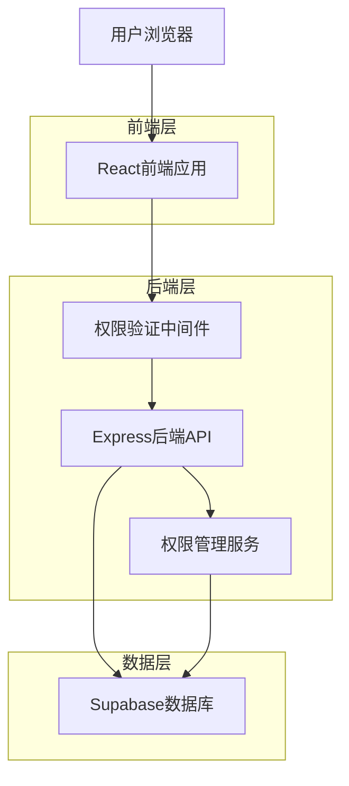
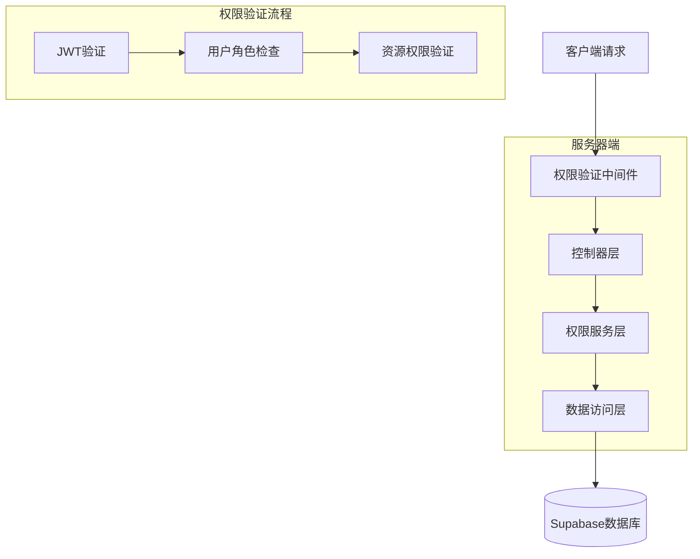
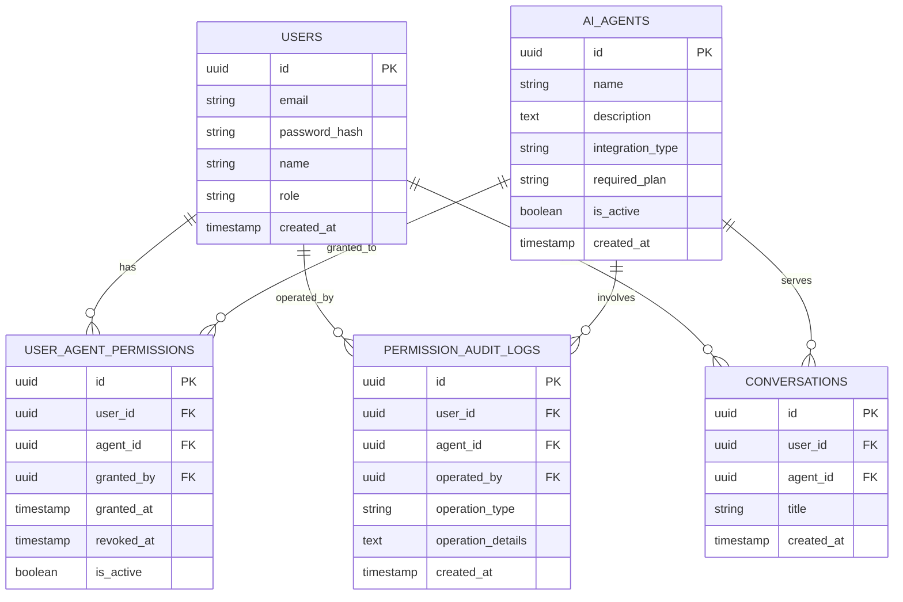

# 用户AI员工权限管理系统技术架构文档

## 1. 架构设计



## 2. 技术描述

* 前端：React\@18 + Ant Design\@5 + TypeScript + Vite

* 后端：Express\@4 + TypeScript + Supabase SDK

* 数据库：Supabase (PostgreSQL)

* 权限验证：JWT + 中间件拦截

## 3. 路由定义

| 路由                 | 用途                  |
| ------------------ | ------------------- |
| /admin/permissions | 管理员权限管理页面           |
| /workspace         | 用户工作台页面（权限过滤后的AI员工） |
| /admin/audit       | 权限审计页面              |
| /api/permissions   | 权限管理API接口           |
| /api/user-agents   | 用户可访问的AI员工API       |

## 4. API定义

### 4.1 权限管理API

**获取用户权限列表**

```
GET /api/permissions/users/:userId
```

请求参数：

| 参数名    | 参数类型   | 是否必需 | 描述   |
| ------ | ------ | ---- | ---- |
| userId | string | true | 用户ID |

响应：

| 参数名     | 参数类型              | 描述     |
| ------- | ----------------- | ------ |
| success | boolean           | 请求状态   |
| data    | UserPermission\[] | 用户权限列表 |

示例：

```json
{
  "success": true,
  "data": [
    {
      "userId": "uuid-1",
      "agentId": "uuid-2",
      "agentName": "金牌文案",
      "grantedAt": "2025-01-17T10:00:00Z",
      "grantedBy": "admin-uuid"
    }
  ]
}
```

**分配用户权限**

```
POST /api/permissions/assign
```

请求：

| 参数名       | 参数类型      | 是否必需 | 描述                |
| --------- | --------- | ---- | ----------------- |
| userId    | string    | true | 用户ID              |
| agentIds  | string\[] | true | AI员工ID列表          |
| operation | string    | true | 操作类型：grant/revoke |

响应：

| 参数名     | 参数类型    | 描述     |
| ------- | ------- | ------ |
| success | boolean | 操作状态   |
| message | string  | 操作结果信息 |

**获取用户可访问的AI员工**

```
GET /api/user-agents
```

请求头：

| 参数名           | 参数类型   | 是否必需 | 描述        |
| ------------- | ------ | ---- | --------- |
| Authorization | string | true | JWT Token |

响应：

| 参数名     | 参数类型       | 描述         |
| ------- | ---------- | ---------- |
| success | boolean    | 请求状态       |
| data    | AIAgent\[] | 可访问的AI员工列表 |

### 4.2 权限审计API

**获取权限操作记录**

```
GET /api/permissions/audit
```

请求参数：

| 参数名       | 参数类型   | 是否必需  | 描述        |
| --------- | ------ | ----- | --------- |
| page      | number | false | 页码，默认1    |
| limit     | number | false | 每页数量，默认20 |
| userId    | string | false | 筛选用户ID    |
| startDate | string | false | 开始日期      |
| endDate   | string | false | 结束日期      |

## 5. 服务器架构图



## 6. 数据模型

### 6.1 数据模型定义



### 6.2 数据定义语言

**用户AI员工权限表 (user\_agent\_permissions)**

```sql
-- 创建用户AI员工权限关联表
CREATE TABLE user_agent_permissions (
    id UUID PRIMARY KEY DEFAULT gen_random_uuid(),
    user_id UUID NOT NULL REFERENCES users(id) ON DELETE CASCADE,
    agent_id UUID NOT NULL REFERENCES ai_agents(id) ON DELETE CASCADE,
    granted_by UUID NOT NULL REFERENCES users(id),
    granted_at TIMESTAMP WITH TIME ZONE DEFAULT NOW(),
    revoked_at TIMESTAMP WITH TIME ZONE,
    is_active BOOLEAN DEFAULT true,
    created_at TIMESTAMP WITH TIME ZONE DEFAULT NOW(),
    updated_at TIMESTAMP WITH TIME ZONE DEFAULT NOW(),
    
    -- 确保同一用户对同一AI员工只有一条有效权限记录
    UNIQUE(user_id, agent_id, is_active) WHERE is_active = true
);

-- 创建索引
CREATE INDEX idx_user_agent_permissions_user_id ON user_agent_permissions(user_id);
CREATE INDEX idx_user_agent_permissions_agent_id ON user_agent_permissions(agent_id);
CREATE INDEX idx_user_agent_permissions_is_active ON user_agent_permissions(is_active);
CREATE INDEX idx_user_agent_permissions_granted_at ON user_agent_permissions(granted_at DESC);

-- 权限审计日志表 (permission_audit_logs)
CREATE TABLE permission_audit_logs (
    id UUID PRIMARY KEY DEFAULT gen_random_uuid(),
    user_id UUID NOT NULL REFERENCES users(id),
    agent_id UUID NOT NULL REFERENCES ai_agents(id),
    operated_by UUID NOT NULL REFERENCES users(id),
    operation_type VARCHAR(20) NOT NULL CHECK (operation_type IN ('grant', 'revoke', 'batch_grant', 'batch_revoke')),
    operation_details JSONB,
    ip_address INET,
    user_agent TEXT,
    created_at TIMESTAMP WITH TIME ZONE DEFAULT NOW()
);

-- 创建索引
CREATE INDEX idx_permission_audit_logs_user_id ON permission_audit_logs(user_id);
CREATE INDEX idx_permission_audit_logs_operated_by ON permission_audit_logs(operated_by);
CREATE INDEX idx_permission_audit_logs_operation_type ON permission_audit_logs(operation_type);
CREATE INDEX idx_permission_audit_logs_created_at ON permission_audit_logs(created_at DESC);

-- 设置权限
GRANT SELECT ON user_agent_permissions TO anon;
GRANT ALL PRIVILEGES ON user_agent_permissions TO authenticated;

GRANT SELECT ON permission_audit_logs TO anon;
GRANT ALL PRIVILEGES ON permission_audit_logs TO authenticated;

-- 初始化数据：为现有用户分配默认权限（可选）
-- 为所有现有用户分配免费计划的AI员工权限
INSERT INTO user_agent_permissions (user_id, agent_id, granted_by, granted_at, is_active)
SELECT 
    u.id as user_id,
    a.id as agent_id,
    (SELECT id FROM users WHERE role = 'admin' LIMIT 1) as granted_by,
    NOW() as granted_at,
    true as is_active
FROM users u
CROSS JOIN ai_agents a
WHERE u.role = 'user' 
  AND a.required_plan = 'free'
  AND a.is_active = true
ON CONFLICT (user_id, agent_id, is_active) WHERE is_active = true DO NOTHING;
```

## 7. 权限验证逻辑

### 7.1 中间件权限验证

```typescript
// 权限验证中间件
export const checkAgentPermission = async (req: Request, res: Response, next: NextFunction) => {
  try {
    const userId = req.user?.id;
    const agentId = req.params.agentId || req.body.agentId;
    
    if (!userId || !agentId) {
      return res.status(400).json({ error: '缺少必要参数' });
    }
    
    // 检查用户是否有权限访问该AI员工
    const permission = await supabase
      .from('user_agent_permissions')
      .select('*')
      .eq('user_id', userId)
      .eq('agent_id', agentId)
      .eq('is_active', true)
      .single();
    
    if (!permission.data) {
      return res.status(403).json({ error: '无权限访问该AI员工' });
    }
    
    next();
  } catch (error) {
    res.status(500).json({ error: '权限验证失败' });
  }
};
```

### 7.2 前端权限过滤

```typescript
// 获取用户可访问的AI员工列表
export const getUserAccessibleAgents = async (userId: string) => {
  const { data, error } = await supabase
    .from('user_agent_permissions')
    .select(`
      agent_id,
      ai_agents (
        id,
        name,
        description,
        avatar_url,
        integration_type,
        is_active
      )
    `)
    .eq('user_id', userId)
    .eq('is_active', true)
    .eq('ai_agents.is_active', true);
    
  return data?.map(item => item.ai_agents) || [];
};
```

