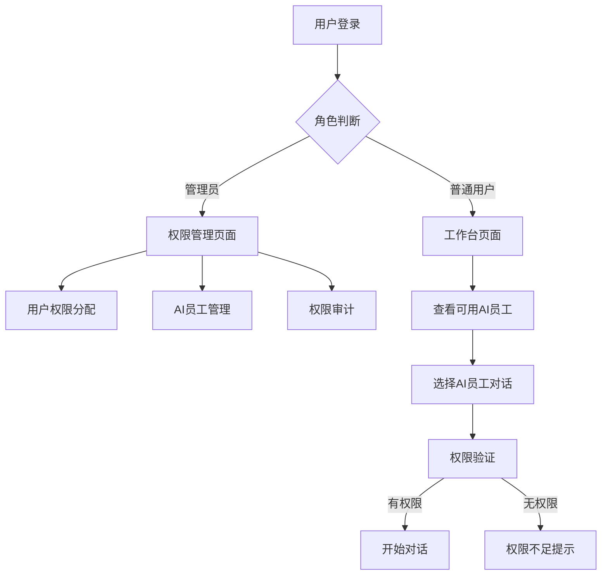

# 用户AI员工权限管理系统需求文档

## 1. 产品概述

本系统旨在为短视频文案助手平台实现用户级别的AI员工权限控制功能，允许管理员为不同用户分配特定的AI员工访问权限，实现精细化的权限管理和资源控制。

系统将解决当前所有用户都能访问所有AI员工的问题，通过权限控制提升用户体验的个性化程度，同时为平台提供更灵活的商业模式支持。

## 2. 核心功能

### 2.1 用户角色

| 角色 | 权限描述 | 核心功能 |
|------|----------|----------|
| 普通用户 | 只能使用被分配的AI员工 | 查看和使用有权限的AI员工，进行对话交互 |
| 管理员 | 管理所有用户的AI员工权限 | 分配/撤销用户权限，查看权限分配情况，管理AI员工 |
| 超级管理员 | 系统全局管理权限 | 用户管理，系统配置，权限策略制定 |

### 2.2 功能模块

本权限管理系统包含以下核心页面：

1. **管理员权限管理页面**：用户权限分配、权限查看、批量操作
2. **用户工作台页面**：显示有权限的AI员工列表、权限状态提示
3. **权限审计页面**：权限变更记录、使用统计分析

### 2.3 页面详情

| 页面名称 | 模块名称 | 功能描述 |
|----------|----------|----------|
| 管理员权限管理页面 | 用户列表模块 | 显示所有用户，支持搜索和筛选功能 |
| 管理员权限管理页面 | 权限分配模块 | 为选定用户分配或撤销AI员工权限，支持批量操作 |
| 管理员权限管理页面 | AI员工管理模块 | 查看AI员工列表，管理AI员工的可用性状态 |
| 用户工作台页面 | AI员工列表模块 | 仅显示用户有权限访问的AI员工，隐藏无权限的员工 |
| 用户工作台页面 | 权限提示模块 | 显示用户当前权限状态，提供升级提示 |
| 权限审计页面 | 操作记录模块 | 记录所有权限变更操作，包括操作人、时间、变更内容 |
| 权限审计页面 | 统计分析模块 | 展示权限使用统计，AI员工使用频率分析 |

## 3. 核心流程

### 管理员权限分配流程
1. 管理员登录系统，进入权限管理页面
2. 搜索或选择目标用户
3. 查看用户当前权限状态
4. 选择要分配的AI员工权限
5. 确认分配操作，系统记录变更日志
6. 用户立即生效新的权限设置

### 普通用户使用流程
1. 用户登录系统，进入工作台
2. 系统根据用户权限过滤AI员工列表
3. 用户选择有权限的AI员工进行对话
4. 系统验证权限后允许访问
5. 记录使用日志用于统计分析

## 4. 用户界面设计

### 4.1 设计风格
- 主色调：蓝色系 (#1890ff) 和灰色系 (#f0f2f5)
- 按钮样式：圆角按钮，12px圆角半径
- 字体：系统默认字体，标题16px，正文14px
- 布局风格：卡片式布局，左侧导航栏设计
- 图标风格：线性图标，统一使用Ant Design图标库

### 4.2 页面设计概览

| 页面名称 | 模块名称 | UI元素 |
|----------|----------|--------|
| 管理员权限管理页面 | 用户列表模块 | 表格组件，搜索框，分页器，操作按钮组 |
| 管理员权限管理页面 | 权限分配模块 | 模态框，复选框组，确认按钮，取消按钮 |
| 用户工作台页面 | AI员工列表模块 | 卡片网格布局，员工头像，名称，描述，状态标签 |
| 用户工作台页面 | 权限提示模块 | 信息提示条，升级按钮，帮助链接 |
| 权限审计页面 | 操作记录模块 | 时间线组件，筛选器，导出按钮 |

### 4.3 响应式设计
采用移动端优先的响应式设计，支持桌面端和移动端访问，针对触屏设备优化交互体验。